<div align="center">
  <h1>KILÓMETRO CERO</h1>
  <p><em>Carreras cenitales · Madrid</em></p>
</div>

A browser-based top-down arcade racer built with [Phaser 3](https://phaser.io/).

Its headline circuit is a layout **inspired by the IFEMA-Valdebebas street
course in Madrid** — 22 corners, two tunnels and a banked semicircle — rebuilt
as a 2D top-down track.

> **This is a derivative work.** The game engine comes from
> [`leereilly/micro-machines`](https://github.com/leereilly/micro-machines)
> (MIT). See [What is derived and what is new](#what-is-derived-and-what-is-new)
> below, and [`NOTICE`](NOTICE) for the full record.

## Play

```sh
npm install     # once
node esbuild.js # bundles game.js → dist/bundle.js
```

Then serve the folder and open it in a browser — `index.html` loads
`dist/bundle.js`, and the music and track textures need HTTP rather than
`file://`:

```sh
python3 -m http.server 8000
# → http://localhost:8000
```

## Features

- 4-player race (1 human + 3 AI opponents): OSO, GATA, CIBELES and MADROÑO
- 23 tracks, all selectable from the start
- Pickups, nitro boosts, tunnels, ramps and terrain effects
- Per-track music


<!-- MAPS_START -->
## Maps

23 tracks, each with a unique theme and visual style.

<table>
  <thead>
    <tr>
      <th>#</th>
      <th>Map</th>
      <th>Screenshot</th>
      <th>Inspiration</th>
      <th>Theme</th>
    </tr>
  </thead>
  <tbody>
    <tr>
      <td align="center">1</td>
      <td><strong>SIDEWINDER</strong></td>
      <td>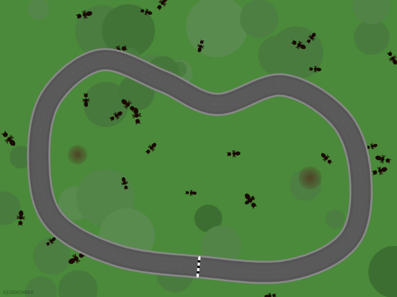</td>
      <td>Classic Micro Machines top-down circuit design</td>
      <td>Green grass and asphalt</td>
    </tr>
    <tr>
      <td align="center">2</td>
      <td><strong>FANDANGO</strong></td>
      <td>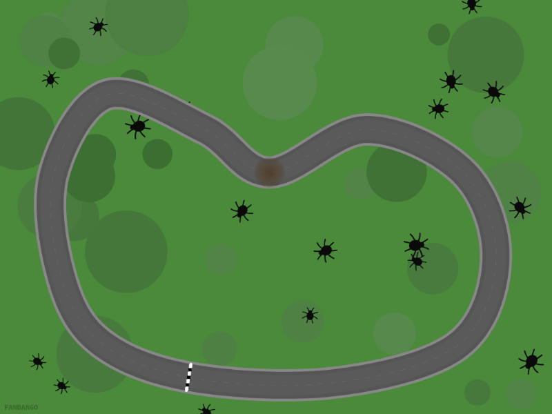</td>
      <td>Classic Micro Machines top-down circuit design</td>
      <td>Green grass and asphalt</td>
    </tr>
    <tr>
      <td align="center">3</td>
      <td><strong>WIPEOUT</strong></td>
      <td>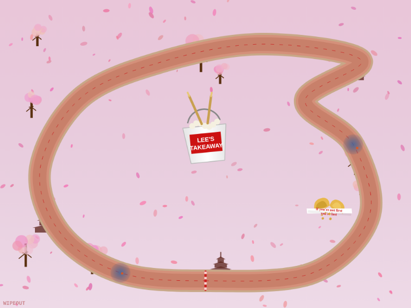</td>
      <td>Wipeout (Psygnosis, 1995) anti-gravity racer — name nod; classic top-down layout</td>
      <td>Japanese cherry blossom park with pagoda silhouettes</td>
    </tr>
    <tr>
      <td align="center">4</td>
      <td><strong>BLASTER</strong></td>
      <td>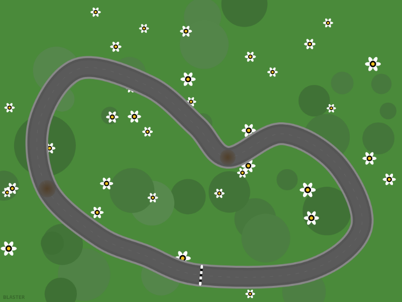</td>
      <td>Classic Micro Machines top-down circuit design</td>
      <td>Green grass and asphalt</td>
    </tr>
    <tr>
      <td align="center">5</td>
      <td><strong>HUEVOS GRANDE</strong></td>
      <td>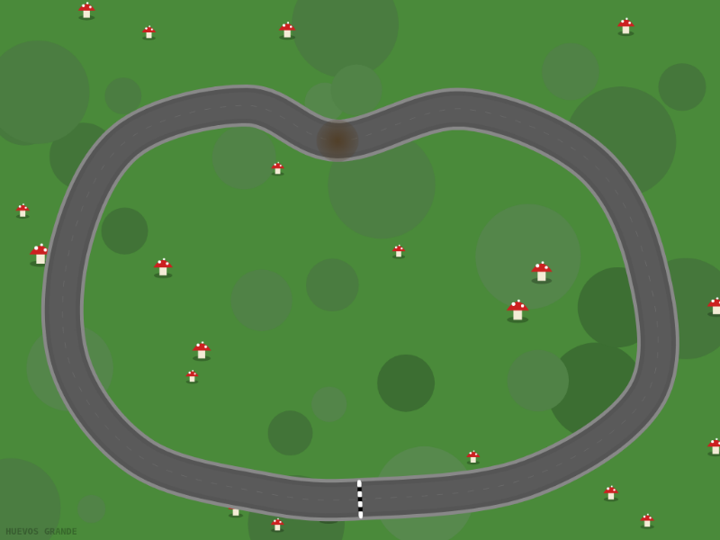</td>
      <td>Classic Micro Machines top-down circuit design</td>
      <td>Green grass and asphalt</td>
    </tr>
    <tr>
      <td align="center">6</td>
      <td><strong>CLIFFHANGER</strong></td>
      <td>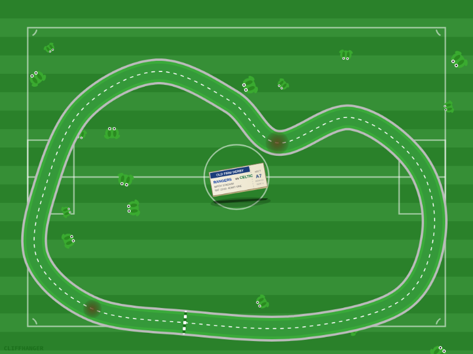</td>
      <td>Ibrox Stadium, Glasgow — Rangers vs Celtic Old Firm Derby</td>
      <td>Football pitch with centre circle and penalty boxes</td>
    </tr>
    <tr>
      <td align="center">7</td>
      <td><strong>BIG DUKES</strong></td>
      <td>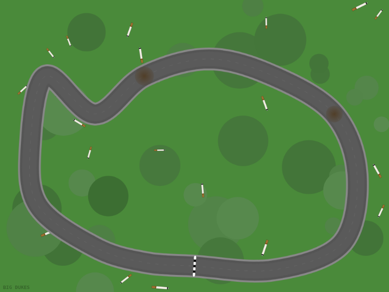</td>
      <td>The Dukes of Hazzard (TV series, 1979–85)</td>
      <td>Green grass and asphalt</td>
    </tr>
    <tr>
      <td align="center">8</td>
      <td><strong>HURRICANE GULCH</strong></td>
      <td>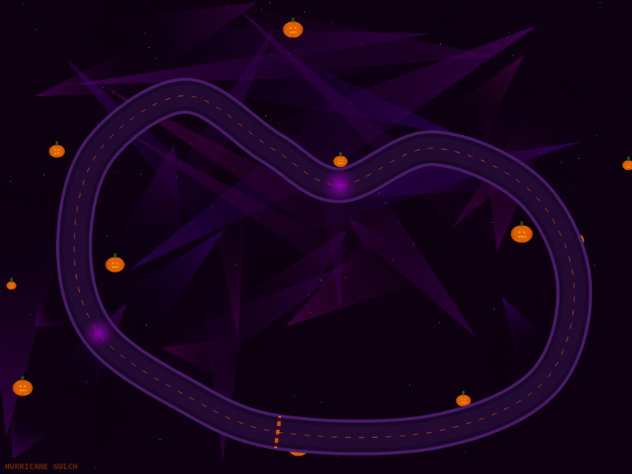</td>
      <td>Halloween seasonal event tracks in Micro Machines and Forza Horizon</td>
      <td>Halloween night — pumpkins, purple sky, glowing slime</td>
    </tr>
    <tr>
      <td align="center">9</td>
      <td><strong>SAFARI RUSH</strong></td>
      <td>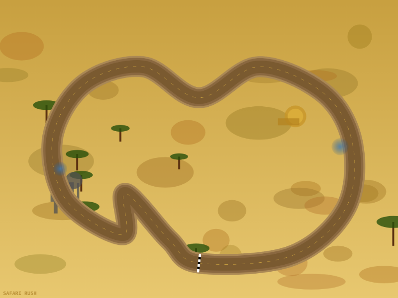</td>
      <td>Circuit de Monaco — tight hairpins and narrow street circuit</td>
      <td>African savanna</td>
    </tr>
    <tr>
      <td align="center">10</td>
      <td><strong>DESERT MIRAGE</strong></td>
      <td>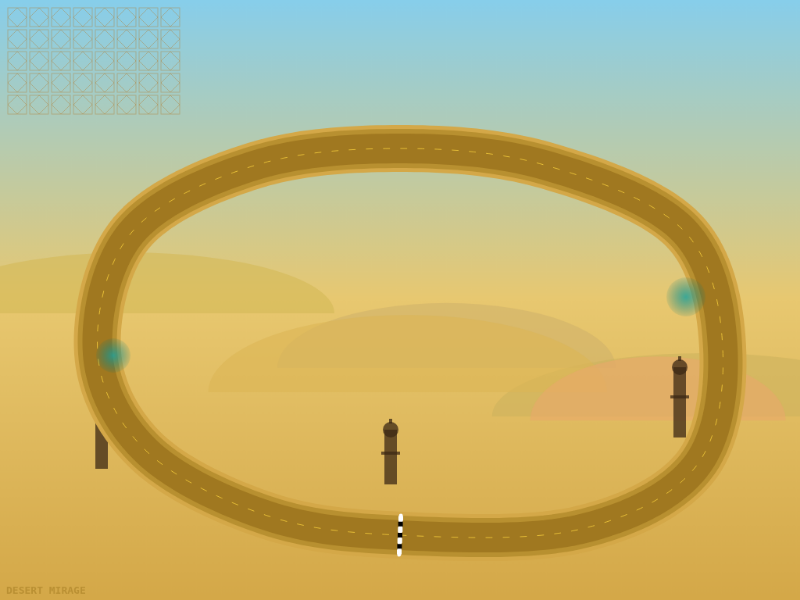</td>
      <td>Bahrain International Circuit / Yas Marina Circuit</td>
      <td>Arabian desert</td>
    </tr>
    <tr>
      <td align="center">11</td>
      <td><strong>COPACABANA CRUNCH</strong></td>
      <td>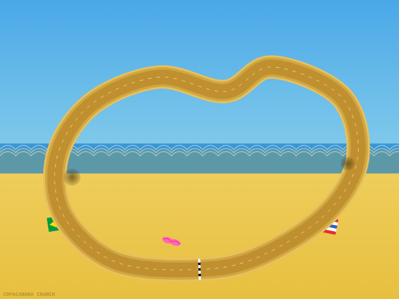</td>
      <td>Autódromo José Carlos Pace (Interlagos), São Paulo</td>
      <td>Brazilian carnival</td>
    </tr>
    <tr>
      <td align="center">12</td>
      <td><strong>LONE STAR RALLY</strong></td>
      <td>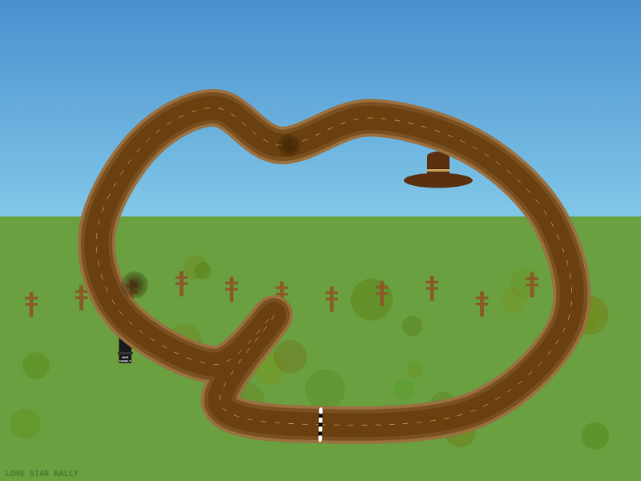</td>
      <td>Circuit of the Americas (COTA), Austin, Texas</td>
      <td>American country / Texas</td>
    </tr>
    <tr>
      <td align="center">13</td>
      <td><strong>JINGLE RALLY</strong></td>
      <td>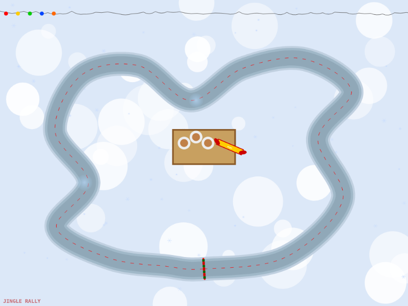</td>
      <td>Nürburgring Nordschleife — winding and highly technical layout</td>
      <td>Christmas / winter holiday</td>
    </tr>
    <tr>
      <td align="center">14</td>
      <td><strong>CURRY CORNER</strong></td>
      <td>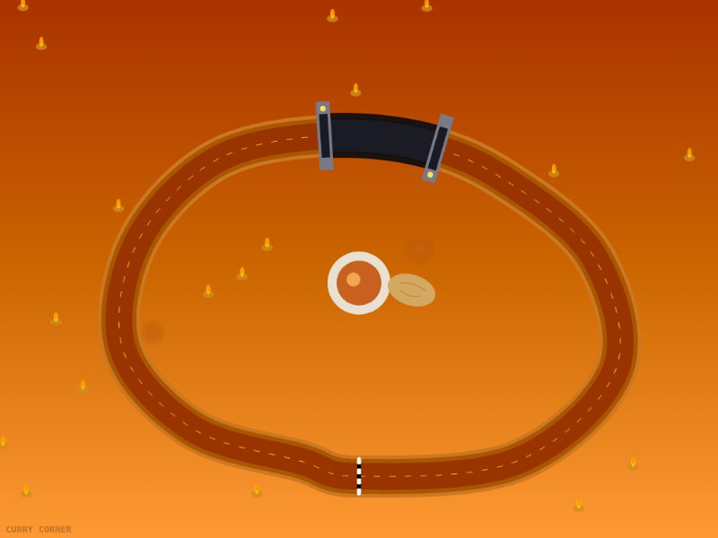</td>
      <td>Indian street circuit with a tunnel through a building</td>
      <td>India — Bollywood and Diwali</td>
    </tr>
    <tr>
      <td align="center">15</td>
      <td><strong>BELLA STRADA</strong></td>
      <td>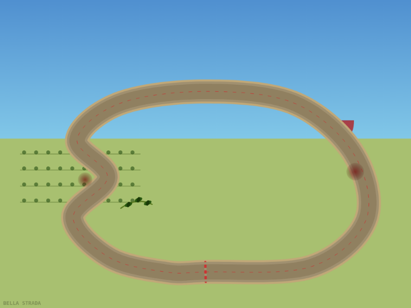</td>
      <td>Autodromo Nazionale Monza — fast main straight with Ascari chicane</td>
      <td>Italy</td>
    </tr>
    <tr>
      <td align="center">16</td>
      <td><strong>LOOSE SLOPS</strong></td>
      <td>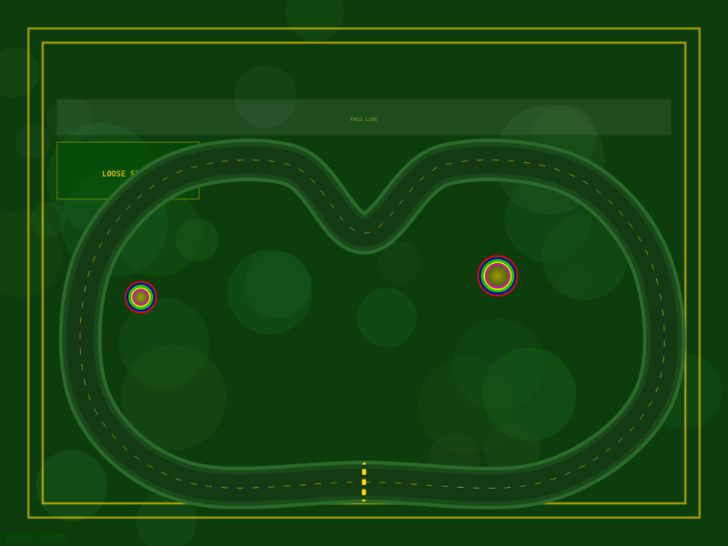</td>
      <td>Las Vegas Strip Circuit — 90° street corners and inner chicane</td>
      <td>Casino / Las Vegas</td>
    </tr>
    <tr>
      <td align="center">17</td>
      <td><strong>SHAMROCK SPRINT</strong></td>
      <td>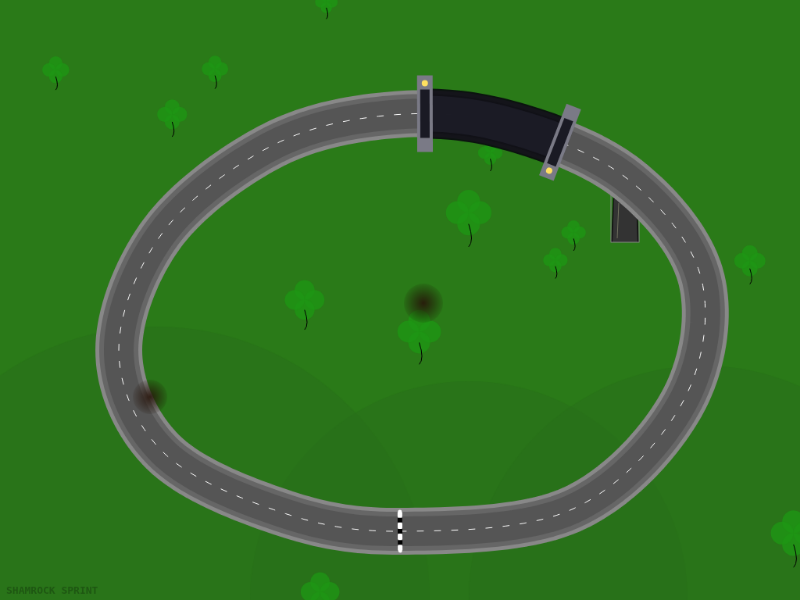</td>
      <td>Irish road racing circuits with a hilltop tunnel</td>
      <td>Ireland — rolling green hills</td>
    </tr>
    <tr>
      <td align="center">18</td>
      <td><strong>EL GRANDE LOOP</strong></td>
      <td>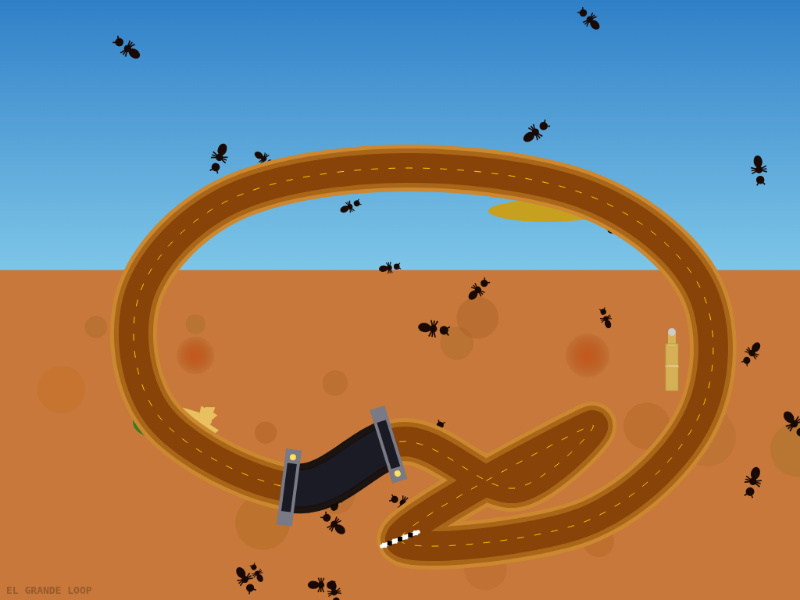</td>
      <td>Autódromo Hermanos Rodríguez, Mexico City</td>
      <td>Mexico — Day of the Dead and Mariachi</td>
    </tr>
    <tr>
      <td align="center">19</td>
      <td><strong>IRIE CIRCUIT</strong></td>
      <td>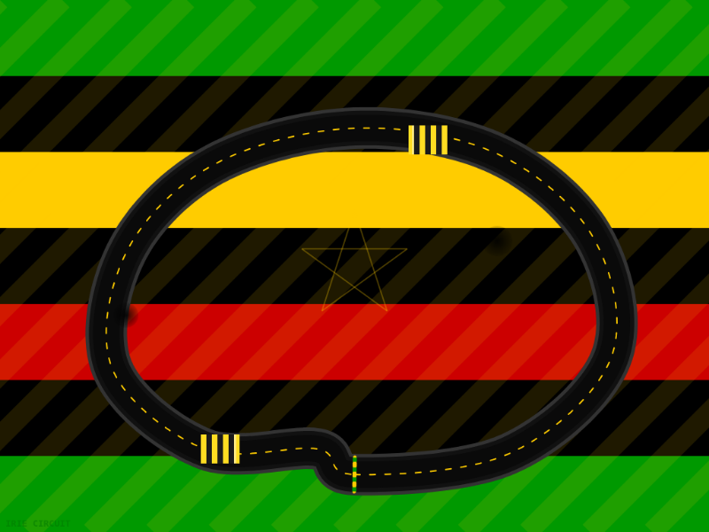</td>
      <td>Original layout with water-jump ramps</td>
      <td>Jamaica — reggae and island vibes</td>
    </tr>
    <tr>
      <td align="center">20</td>
      <td><strong>OLÉ DASH</strong></td>
      <td>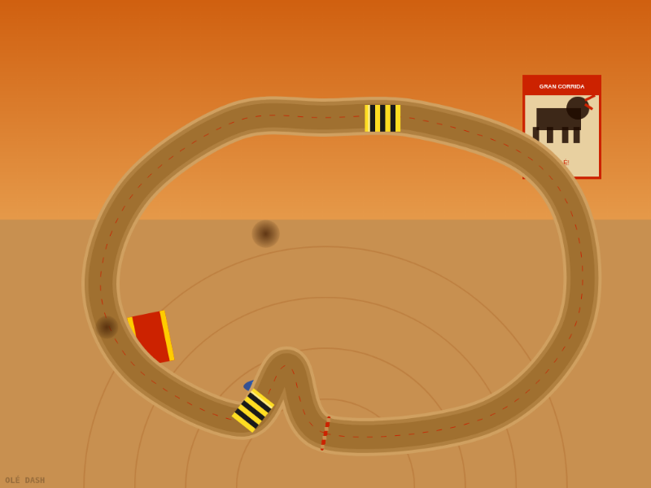</td>
      <td>Spanish arena-edge street circuit</td>
      <td>Spain — flamenco and bullfighting arena</td>
    </tr>
    <tr>
      <td align="center">21</td>
      <td><strong>JUNGLE JAMBOREE</strong></td>
      <td>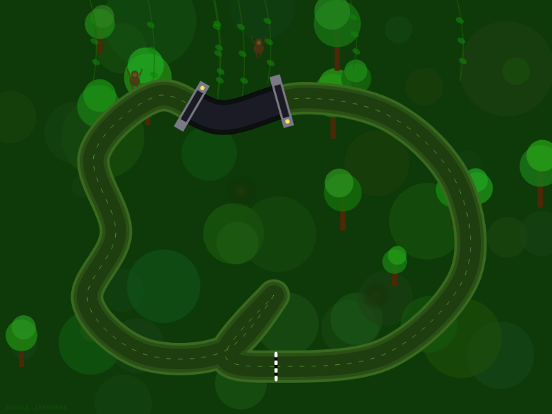</td>
      <td>Sepang International Circuit / Singapore Street Circuit</td>
      <td>Tropical jungle with monkeys and hanging vines</td>
    </tr>
    <tr>
      <td align="center">22</td>
      <td><strong>NEON DRIVE</strong></td>
      <td>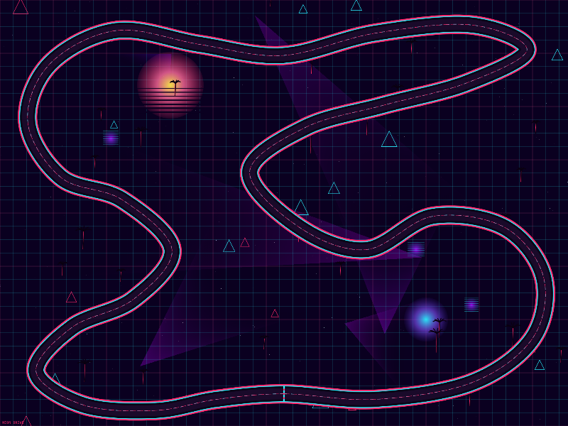</td>
      <td>OutRun (Sega, 1986) — multi-screen synthwave aesthetic</td>
      <td>1980s synthwave / retrowave neon grid</td>
    </tr>
    <tr>
      <td align="center">23</td>
      <td><strong>DESK CHAOS</strong></td>
      <td>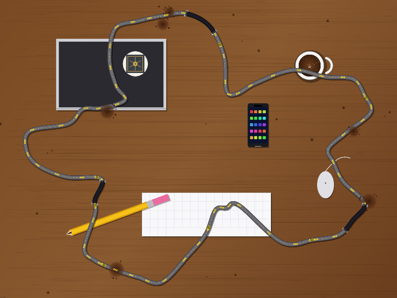</td>
      <td>Micro Machines (Codemasters, 1991) — kitchen table and desk levels</td>
      <td>Office desk — procedurally generated layout (different every run)</td>
    </tr>
  </tbody>
</table>

<!-- MAPS_END -->

## What is derived and what is new

### Derived from `leereilly/micro-machines` (MIT)

Effectively the whole engine, unchanged or lightly extended: the vehicle
physics, the AI opponents and their rubber-banding, the Catmull-Rom track
generator, the colour-mask collision system, pickups and nitro, the terrain
multipliers, the tunnel and ramp mechanics, the menus and race scenes, and 22
of the 23 tracks. Copyright remains with Lee Reilly and the upstream
contributors under the MIT licence in [`LICENSE`](LICENSE).

### New in this project

| Change | Why |
|---|---|
| The four drivers — OSO, GATA, CIBELES, MADROÑO — drawn procedurally from primitive shapes at boot (`BootScene.genDrivers`) | Replaces the upstream `players/` art, which was **not** MIT-licensed (see below) |
| Deleted the whole `players/` directory (8 PNGs) | Same reason — the project now ships no character art files at all |
| Replaced the Octocat sticker on the DESK CHAOS laptop with an original "KM 0" road-marker sticker | Removes a third-party trademark from the artwork |
| Renamed the product, page title and on-screen title | See [Naming and trademarks](#naming-and-trademarks) |
| Added [`LICENSE`](LICENSE) and [`NOTICE`](NOTICE) | Upstream had no `LICENSE` file — only a line in its README |

### Removed, and why

Upstream carried an explicit carve-out from its own MIT grant:

> Files in the `players/` directory are copyrighted by their respective owners
> and are included here for reference/attribution purposes only.

Those eight files were the AI rivals' faces and cars. Copilot, Hubot and Mona
are GitHub mascots and were never redistributable under MIT. They have been
deleted, not re-licensed. **Every file in this repository is now covered by
`LICENSE`, with no carve-out.**

## Naming and trademarks

This project is unaffiliated with, and not endorsed by, any rights holder
named here.

- **"Micro Machines"** is a trademark of Codemasters / Hasbro. It appears in
  this repository only to identify the upstream project we derive from, which
  MIT attribution requires.
- **"MADRING"** is a trademark of the Gran Premio de Madrid. It is used only as
  an internal identifier in the source (the track object's `name` field). To
  players and on this page the circuit is described as a *layout inspired by
  the IFEMA-Valdebebas street course*.
- **"Formula 1" / "F1" / "Grand Prix"** are trademarks of Formula One
  Licensing BV and are not used in this project's naming or track dressing.
- **"GitHub", "Octocat", "Copilot", "Hubot", "Mona"** are trademarks of
  GitHub, Inc.; all associated artwork has been removed.

## License

MIT — see [`LICENSE`](LICENSE), which covers both the upstream work and the
additions made here. [`NOTICE`](NOTICE) records the provenance in detail.

## Credits

- **Lee Reilly and contributors** — the original
  [micro-machines](https://github.com/leereilly/micro-machines) engine (MIT)
- **Kenney** — vehicle art reference
  ([Racing Pack](https://kenney.nl/assets/racing-pack), CC0)
- **MFCC** — music ([Pixabay](https://pixabay.com/users/28627740/))
- **Phaser 3** — game framework (MIT)
