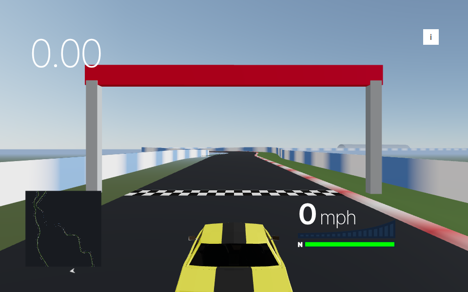
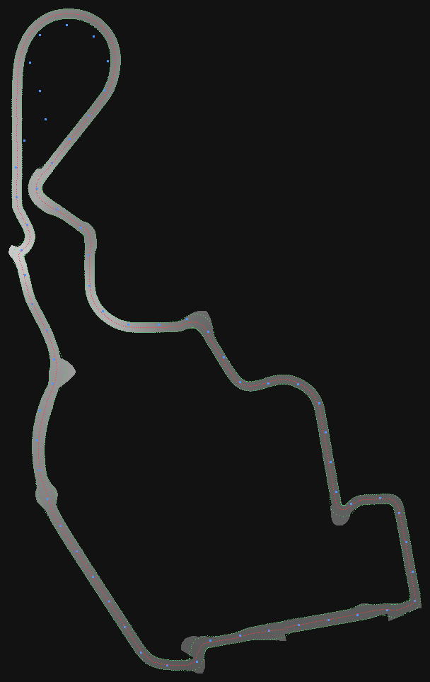
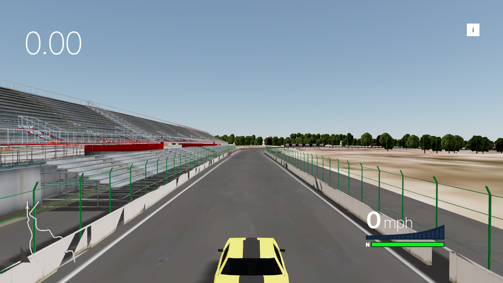
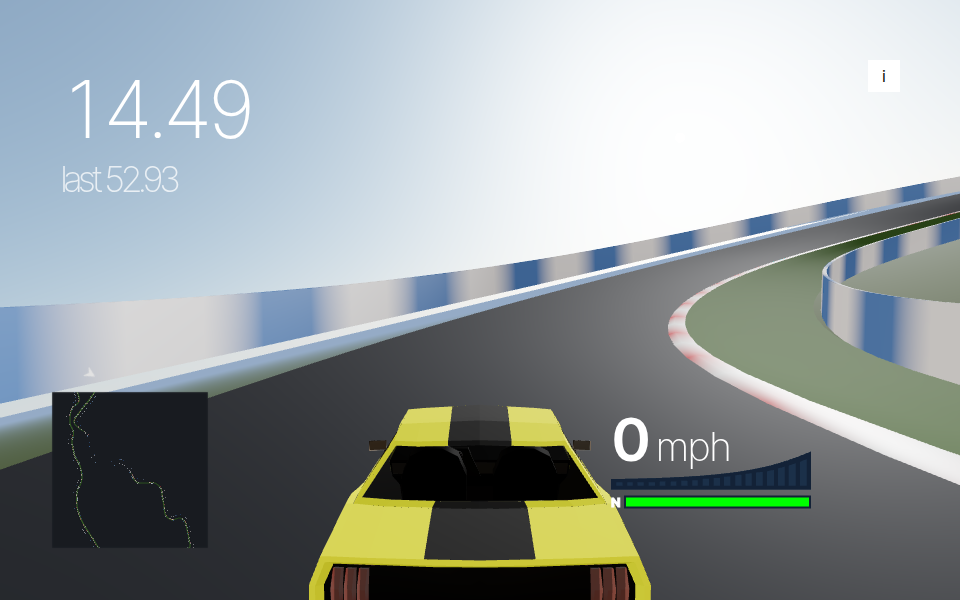

# Kilómetro Cero — 3D circuit mode

A second game mode for this repository: a 3D racing game set on the
IFEMA-Valdebebas street course in Madrid — a 3D model of the circuit, with the
road the car drives on measured off that model rather than invented.

The root of this repository is a top-down Phaser game. This directory is a
separate, self-contained Vite + TypeScript app and does not share code with it —
only the circuit data in `../scripts/madring-centreline.js`.



## What it is derived from

This is a derivative of **[colyseus/react-racing-game][fork]**, itself a fork of
**[@pmndrs/racing-game][pmndrs]** — React Three Fiber, zustand, Vite. Both are
MIT. The application shell, cameras, effects and HUD are theirs; the circuit is
a CC-BY-4.0 model by Dave Love plus the code that aligns it, measures a road out
of it and makes it drivable.

The car is neither of theirs any more: the upstream `@react-three/cannon`
raycast vehicle (and with it the whole cannon physics world) has been replaced
by an analytic four-corner vehicle model adapted from
**[APEX FORMULA 2026][apex]** (Apache-2.0, © 2026 Avi Hacker, J.D.), together
with its formula car model. See *Making it drive* below and NOTICE section 2.

The desert map they ship has been removed entirely, along with the Colyseus
multiplayer server and the hosted Supabase leaderboard. Read **[NOTICE](NOTICE)**
for the full accounting — what was inherited, what was deleted and why, and
which third-party attributions still apply.

[fork]: https://github.com/colyseus/react-racing-game
[pmndrs]: https://github.com/pmndrs/racing-game
[apex]: https://github.com/ahacker-1/apex-formula-2026

## Run it

```sh
cd madring-3d
npm install
npm run dev      # vite, http://localhost:3000
```

```sh
npm run build    # tsc && vite build  ->  dist/
npm run serve    # preview the production build
```

The circuit model is committed pre-compressed, so none of this needs the 135 MB
source. To rebuild it from that source (see *The circuit* below):

```sh
npm run build:fit     # align the model, measure the road  -> src/circuit/road.ts
npm run build:model   # compress it                        -> public/models/
npm run build:assets  # both
```

No server, no account, no network. Everything the page needs is served from
`public/`, including the Draco decoder that upstream fetched from a Google CDN.

Drive with the arrow keys or WASD (`↓`/`S` brakes, and held at a standstill,
reverses). `Space` is the drift/handbrake, `Shift` boosts, `R` puts you back on
the circuit, `C` cycles chase / first-person / bird's-eye, `M` toggles the
minimap, `I` shows the full key list, and `.` opens the **live tuning panel** —
every constant of the car, the camera and the body attitude, adjustable while
driving, persisted to localStorage (see *Making it drive*).

A **gamepad** works too (standard mapping, hot-pluggable): left stick steers —
analog, dead-zoned and curve-shaped, live-tunable — RT/LT are analog
throttle/brake, `A` boosts, `X` is the handbrake, `Y` cycles the camera, `B`
resets. Keyboard and pad are merged per channel every tick, so both stay live.

You are not alone out there: the game is a **five-car race**. Four AI drivers
grid up ahead of you, the start gantry runs a five-red-lights sequence (the
field is held until lights-out), and a position board keeps score — see *The
race*.

## The circuit

The circuit is a 3D model:

> This work is based on **["Circuito de Madring 2026 layout"][model]** by
> **[Dave Love SketchFab][author]**, licensed
> **[CC-BY-4.0](http://creativecommons.org/licenses/by/4.0/)**.

[model]: https://sketchfab.com/3d-models/circuito-de-madring-2026-layout-5bbaf6e5048643858a498bc8a4ef4c05
[author]: https://sketchfab.com/Tyler_Dave

That credit is a licence condition, not a courtesy. It is reproduced in
[NOTICE](NOTICE), at the top of `src/models/track/Circuit.tsx`, and on the
game's intro screen. Do not remove it while the model is in use.

It supplies everything the procedural circuit did not: asphalt, kerbs, painted
lines, tyre marks, concrete walls, catch fencing, the pit building and pit lane,
the grandstands, the start gantry with its LED boards, floodlights, trackside
signage, parked vehicles, trees, and the city around it. There is no crowd in
it — the stands are modelled empty, seats and railings and distance boards, and
no amount of rendering will put people in them. So the people are generated;
see *The crowd*, which places them off the model's own grandstand geometry.

### Shipping it

The model as Sketchfab distributes it is 134.65 MB — a 98 MB `.bin`, 37 MB of
PNG (of which 35 MB is one 4096² backdrop) and a 164 KB `.gltf`. What is
committed here is 80.82 MB of that, repacked by `scripts/shrink-source.mjs`
without moving a vertex; see *Repacking the source*. `npm run build:model` turns
it into **8.81 MB** by

1. baking in the alignment transform (below) so the runtime needs no magic
   numbers;
2. dropping `TANGENT` and `TEXCOORD_1` — three derives the tangent frame in the
   fragment shader, and nothing reads the second UV set — and undoing the
   storage quantisation `shrink-source.mjs` applied, because Draco's own normal
   codec does better from floats;
3. welding duplicate vertices;
4. cutting every mesh that spans more than 320 m into 256 m tiles (see
   *Performance*);
5. re-encoding the textures as WebP, capped at 1024² (only the backdrop is
   affected — everything else is 256² or smaller);
6. Draco, 14-bit positions quantised per mesh, which over a 256 m tile is 1.6 cm.

What that costs: the backdrop panorama loses half its resolution each way, WebP
at quality 82 is lossy, and 14-bit positions are not exact. No geometry is
removed and nothing is simplified — the triangle count out is the triangle count
in, 1,689,008.

The source stays in `assets/madring-sketchfab/` and **is** committed, so a clone
can re-run the whole pipeline without a Sketchfab account (see the note in
`.gitignore`). `npm run build:assets` runs the fit and the compression together.

### Repacking the source

`scripts/shrink-source.mjs` is what makes committing it survivable. GitHub
rejects any single file over 100 MiB and the `.bin` arrived at 97.7 MiB, so a
re-export that grew by 3% would have made pushes fail outright. The script takes
that to 72.0 MiB and the textures from 36.8 MiB to 4.9 MiB — 128.6 MiB down to
77.1 MiB — by converting the indices from `u32` to `u16` (exactly lossless: no
primitive here has 65536 vertices), storing `NORMAL` as normalized `int16` under
`KHR_mesh_quantization`, dropping the `TANGENT` and `TEXCOORD_1` that
`build-circuit-model.mjs` was throwing away anyway, and re-encoding the 4096²
backdrop PNG as a 2048² JPEG — still twice the resolution anything ships at.

What it does **not** touch is `POSITION`, which comes through byte for byte.
That is the whole point: `fit-circuit.mjs`, `scripts/madring-model-fit.js` and
`scripts/madring-road-centre.js` derive the racing line, the lap timing and the
barriers from these floats, so `src/circuit/{fit.json,road.ts,barriers.ts}` and
`scripts/MADRING-VALIDATION.md` all regenerate bit-identical from the repacked
source. The largest change anywhere in the model is 0.0015° of normal, against
the 10-bit octahedral normals Draco ships.

### Aligning it to the geodata

`npm run build:fit` (`scripts/fit-circuit.mjs`) fits the model to the projected
centreline in `src/circuit/centreline.ts` — 116 published lat/lon points from
[bacinger/f1-circuits][f1c], projected to a local metric plane.

[f1c]: https://github.com/bacinger/f1-circuits

Both are already at true metric scale, so the fit is **rigid**: a yaw and a
translation, nothing else. Every vertex of the model's `TarmacDark` mesh is
pushed to its nearest point on the Catmull-Rom centreline and a *trimmed* RMS is
minimised — the worst 20% of residuals are dropped, so the pit lane, the run-off
aprons and the stretches where the geodata and the artist genuinely disagree
cannot drag the whole circuit sideways. 360 starting yaws are tried, mirrored
and not; Nelder-Mead refines the winner.

The result, on top of the glTF's own Z-up → Y-up rotation:

| | |
|---|---|
| yaw about +Y | **−0.3863°** |
| translation | **(+84.00, 0, +3.33) m** |
| scale | **1** (not fitted) |
| mirrored | no |



*The model's asphalt in grey, shaded by height; the 64 projected geodata control
points in blue; the measured centreline in red; the lines the walls stand on in
green. Written by `npm run build:fit` — if the red does not follow the grey, the
fit is wrong.*

and the model's tarmac then sits a **mean of 10.74 m / median 6.99 m** from the
projected centreline (p95 35.77 m, max 88.69 m). Those residuals are not fit
error. They are the two sources disagreeing: same circuit, same scale, same
place, different curve.

### Reading the road back out

A rigid fit is not enough to drive on. If the model's walls are 7 m from where
the game thinks the road is, they cross it. So the model wins outright: the
aligned tarmac is rasterised to a 1 m occupancy/height grid, and the road is
**measured** off it. At each of 1024 samples the script scans sideways, splits
the scan into runs of asphalt, takes the nearest road-shaped one, and records

* the middle of the paved corridor,
* how far the asphalt runs to the left and to the right,
* the surface height,
* the cross-slope.

Two details make that work. Runs wider than 36 m are rejected as not
road-shaped, which keeps the centreline out of the run-off lay-by on the outside
of the north loop; and a sample that finds no asphalt at all is interpolated
between the samples either side rather than left where it was, because on that
same loop the geodata is 60 m off the model and no scan we dare make would reach.
The passes go wide (34 m) then narrow (20 m).

That is written to `src/circuit/road.ts`, and *everything* the game does with the
circuit is driven from it — lap timing, the minimap, respawns, the grid slot, the
walls — so all of it lands on asphalt the player can see. The start/finish index
is the sample nearest the model's own start gantry, which lands 1.8 m from the
measured centreline.

Measured off the model:

| | |
|---|---|
| lap | **5428.9 m** (published 5474 m, −0.8%) |
| paved corridor | 24.2 – 51.6 m edge to edge |
| elevation | −7.2 → +16.9 m, a 24.1 m range |
| cross-slope | up to 2.8° |
| coverage | 99.69% of the 30,924 m² between the walls is asphalt |

The old procedural ribbon is gone — `src/circuit/geometry.ts` and everything it
swept. Keeping it as a physics surface under the model was possible but pointless:
the model's own tarmac is the better surface *and* it is guaranteed to be where
the model is drawn, which a parallel ribbon never is.

### Collision

There is no collision engine any more — and that is an upgrade, not a cut.

The car lives in the **track frame** (`src/circuit/trackFrame.ts`): distance
along the measured centreline, a signed lateral offset, and a heading. In that
frame the walls are not bodies to collide with; they are the measured corridor
itself:

**The asphalt.** The surface height, longitudinal grade and cross-slope under
the car are sampled from the measured road (the same 1,024-sample data the
walls, minimap and lap timing use) and fed into the vehicle model as gravity
terms; the rendered car is pitched and rolled onto the surface by four height
probes. Elevation, camber, crests and dips are all felt, exactly as measured
off the model.



**The walls.** Each sample knows how far the asphalt runs to either side; the
wall face stands 0.8 m outside that edge — *unless the wall the player can see
stands closer*. The asphalt edge is the only closed line the road scan can
measure, but this artist paved generously: at the pit straight, the run-off
aprons and the lay-bys the corridor keeps going for up to 15 m past the
rendered barriers, and a clamp at the asphalt edge let the car drive clean
through a drawn wall (players noticed). So the shipped model is surveyed a
second time: `npm run build:barriers` raycasts the compressed .glb from the
centreline outwards at every sample, at two heights (a hit must be vertical
and wall-sized — kerbs, painted lines and overhead signage do not register),
and writes the *visible barrier line* to `src/circuit/barriers.ts`. The wall
limit per side is then `min(asphalt edge + 0.8 m, measured barrier)`,
slew-limited along the lap so a wall's leading edge is an angled funnel
rather than an 8 m sideways teleport. Over half the lap the visible barrier
is what you now hit.

Every physics tick the car's yaw-aware footprint is clamped against those
limits *analytically* (the wall-space impact response is adapted from APEX
FORMULA 2026): the position is corrected only along the wall normal, the
tangential velocity survives a graze at 72–94%, and the outward velocity
becomes a small separation speed. There is nothing to tunnel through, at any
speed, because there is no discrete collision to miss.

Swept from 128 spawn points around the lap, both sides, at 30 / 60 / 90 m/s
and 90° / 60° / 45° / 30° / 20° incidence — 1,920 impacts through the real
compiled controller: **zero escapes, zero penetration beyond the wall face**,
at every angle and speed (the cannon chain, at its best, still leaked 2–8% of
shallow impacts). Confirmed in a real browser, stepping the game's own module
at 60 Hz: head-on at 288 km/h the car never crosses the wall face and comes
away at 16 km/h. (That sweep was also the alibi for the drivable-through
walls above: it proved the *analytic* wall watertight while the analytic wall
stood somewhere the player could not see. Both were true. The barrier survey
closed the gap, and driving at the rendered walls at five places around the
lap now stops at the rendered wall, at zero over-penetration.)

**Nothing else collides**, same as before: grandstands, the pit building, the
city, fences, tyre stacks are decoration. A street circuit is defined by its
walls; get those right and nothing else needs to be solid. You can no longer
reach the scenery anyway — the analytic walls have no gaps to slip through,
and with no killzone needed there is nowhere to fall.

### Performance

Measured, not guessed — this sandbox renders through SwiftShader at a fraction
of a frame per second, so frame rates from it would be meaningless. What is
meaningful is what the renderer is asked to do. Teleporting the car around the
lap and reading `WebGLRenderer.info`:

| | min | median | max |
|---|---|---|---|
| draw calls / frame | 182 | 533 | 1237 |
| triangles / frame | 182 k | 574 k | 1.64 M |

against 1,481 meshes and 1,689,008 triangles in the file, measured at the same
16 teleport points with the race running.

The previous survey read 216 / 730 / 1036 and 288 k / 889 k / 1.52 M. What
changed since: four AI cars (~45 draw calls and ~28 k triangles each, but only
when inside the frustum — the max above is the pack in view, the min is the
far side of the circuit from it), the flags/birds/crowd additions (5 draw
calls, ~55 k triangles, total), and AI cars only cast shadows within 120 m of
the player. The min/median moving *down* despite more content is teleport
placement relative to the pack, not an optimisation claim.

Two corrections to how this is measured. Those numbers **exclude the shadow
pass**: three.js calls `info.reset()` again *after* rendering shadow maps, so
`info.render` only ever describes the beam pass. And the figure has to be taken
from the heaviest `render()` call of the frame, not from a frame callback — the
minimap takes over the render loop with a priority-1 `useFrame` and draws its
own two-sprite overlay scene last, so reading `gl.info` naively reports "2 draw
calls, 4 triangles" for the whole game. `window.__render` now wraps
`WebGLRenderer.render` and keeps the largest pass.

That spread is the whole point of tiling. The source is one merged mesh per
material, each stretching across the entire 1.9 km circuit, so frustum culling
could never reject a single one of them: 86 draw calls, and all 1.69 M triangles
submitted every frame from every camera angle. Cut into 256 m tiles, culling
throws away 43–90% of the geometry. The trade is roughly 5× the draw calls for
roughly 2.6× fewer triangles at the median, and **which side of that wins on real
hardware has not been measured** — only that the tiled version submits far less
geometry.

There is no instancing and no LOD. Instancing has nothing to work with: the
Sketchfab export already merged every repeated grandstand, tree and lamp post
into one mesh per material, so the repetition the source had is gone before the
file arrives. LOD would need decimated copies of 60 materials' worth of geometry
and roughly doubles the download; tiling plus culling was the cheaper win.
The road surface does not cast shadows (it would only shadow-acne itself), and
the sun follows the car — its shadow frustum used to sit at a fixed world
position, which on a circuit this size meant nothing near the player was ever
shadowed. See *Lighting* for why that frustum is only 170 m across.

The crowd is 7,751 spectators in **two draw calls**: two `InstancedMesh`es of
two triangles each. See *The crowd*.

### La Monumental

The signature banked loop is still **found, not placed**, and now from the
model's own geometry. Prefix sums over the signed curvature of the measured road
locate the 550 m window whose *signed* mean curvature is largest in magnitude —
by construction the section that turns hardest and never changes direction.



Measured off the model, the corner found this way is 551 m long, turns through
207°, has a 153 m radius and a paved corridor 27.7 m wide, and its cross-slope
runs 1.5–2.8°.

The real corner is said to be banked at **24%** — 13.5°. The model is not, and
**this has been left alone deliberately.** The reasoning, since it is the one
place where the project's "the model wins" rule visibly costs something:

* There is no code path that can bank it. The car drives on the model's own
  `TarmacDark` trimesh, not on a generated ribbon; the `bank` figure in
  `road.ts` only orients the road *frame*, which places the walls, the grid slot
  and respawns. Changing that number would move the walls and leave the surface
  under the wheels exactly as flat as before.
* Banking it for real means deforming the model's vertices. That much is
  possible without desynchronising anything — the drawn mesh and the collision
  trimesh come from the same `scene`, so rolling one rolls the other. What
  cannot be kept in sync is *the rest of the corner*. 24% across a 27.7 m
  corridor is a 6.6 m edge-to-edge height difference; the model has 1.2 m. The
  outer edge of the asphalt would rise about 2.7 m above where it is drawn now,
  for 551 m, while the concrete barrier beside it, the kerbs, the run-off, the
  catch fencing and the grandstands behind them stay where the artist put them.
  You would be driving up a wall of tarmac that had torn away from its own
  scenery.

So the cost is recorded rather than papered over: at 2.8° and a friction
coefficient of 1.6 the 153 m radius is worth about 186 km/h; at the real 13.5°
it would be worth 241 km/h. La Monumental is a fast corner here, but not the
corner it is supposed to be.

## Making it drive

Two rounds of complaint shaped the car. Round one — *se siente lento, no
responde directamente* — was answered by tuning the upstream `RaycastVehicle`
(more power, more grip, speed-sensitive steering; 0–100 went from 3.97 s to
2.73 s). The player drove it and delivered round two: *no se siente como
conducir*. Parameter tuning on a toy raycast vehicle had hit its ceiling, so
the vehicle was replaced, not re-tuned — with the model from **APEX FORMULA
2026**, an open-source (Apache-2.0) racer the player independently judged
*más real*.

### The car, mark II

The car is one analytic rigid body in the track frame, stepped at a fixed
60 Hz (`src/vehicle/`, adapted — see NOTICE):

- a **four-corner tyre model**: load-sensitive grip, a combined-slip friction
  circle per wheel, tyre relaxation over distance, per-wheel spin with TC and
  ABS clamps, deterministic load transfer from the previous tick;
- **massive downforce** (CLA 4.3 — ~2.3× the car's weight at 300 km/h), which
  is the secret of "planted at speed": fast corners grip harder the faster you
  go, instead of washing out;
- an 8-speed gearbox with per-gear tops (auto by default), 585 kW plus a
  240 kW **boost** (Manual Override) that drains the boost gauge — braking
  harvests it back;
- a **speed-dependent steering clamp** (`0.05 + 0.42/(1 + 0.085·v)` rad, the
  reference's curve) plus rate-limited digital steering, so held arrow keys
  ask for a usable wheel angle at 300 km/h and full lock in the hairpin. The
  attack and centre-return rates are tunable from the panel (the shipped
  return is faster than the reference's — releasing the key straightens the
  car crisply instead of letting the lock linger). A **gamepad stick bypasses
  the digital shaping entirely** and is followed near-directly through the
  same physical clamp;
- assists **on by default** — TC, ABS, auto-gear, a lateral stability term —
  which is why it is approachable despite being a simulation. `Space` is the
  drift/handbrake: rear-only brake force, reduced rear grip, and the
  electronic straitjacket (stability + most of the yaw damping) released for
  as long as it is held. A short tap breaks the rear loose into a 20–25°
  slide; holding it spins you, as a handbrake should;
- visual **body attitude** — dive under braking, squat under power, roll into
  corners (clamped at ~2.6°) — applied to the chassis mesh only, never fed
  back into the dynamics.

Measured on the shipped defaults by a headless rig that steps the *same
compiled controller* the game runs (scratchpad rig; a 150 s drive takes
~35 ms):

|  | mark I (raycast) | mark II (analytic) |
|---|---|---|
| 0–100 km/h | 2.73 s | **2.85 s** (traction-limited launch) |
| 0–200 km/h | 5.52 s | **5.28 s** |
| 0–300 km/h | 8.38 s | **9.88 s** (9.55 s with boost) |
| top speed | ~317 km/h | **347 km/h** (gear-limited) |
| 200–0 km/h | 2.93 s / 95 m | **2.95 s / 68.5 m** |
| steady lateral g @ 150 km/h | — | **2.64 g** (67 m radius, full lock) |
| held full lock @ 250 km/h | — | **29°/s** steady yaw |
| yaw response (step steer → 90%) | — | **0.17–0.20 s** |
| lateral-velocity decay τ @ 150 km/h | — | **0.23 s** |

The numbers to feel in those: at 250 km/h a held full lock still visibly
rotates the car instead of ploughing, a step of steering answers within a
fifth of a second, and injected sideways velocity dies in a quarter of one —
direct, but earned through tyres rather than by faking the velocity vector.

### The tuning panel

Only the player can judge feel, so every constant is live. `.` opens a leva
panel (upstream shipped leva; the panel is new) with the car — mass, power,
boost power, μ, downforce CLA, drag CDA, rolling drag, cornering stiffness and
its front/rear split, yaw inertia — the steering clamp's four curve
parameters plus the keyboard attack/centre-return rates, the gamepad dead
zone and response curve, the four assists as toggles, the handbrake's force and grip, the
camera's FOV base/speed/boost ramps, its easing rate and shake, and the
body-attitude gains. Values apply on the next physics tick (no rebuild, no
respawn), persist to localStorage, and `reset tuning` restores the shipped
defaults. The panel overlays the game; the car stays drivable while it is
open.

### The camera

This was the larger half of "feels slow". A racing game sells speed with the
camera, and this one was doing the opposite of everything it needed to:

* it ran at drei's default **50° field of view**, which at 300 km/h is a
  telephoto lens. It is now 62° at rest, opening to 84° at top speed and 93°
  under boost, eased over about a quarter of a second;
* it **backed away** as the car got faster (`-5 - speed / 15`: 5 m behind at
  rest, 11 m flat out). Retreating from the action is how you make something
  look slower. It now closes up instead, 5.2 m to 8.3 m;
* it eased towards its target with `lerp(v, delta)` — a lerp factor of one
  frame-time, which is a **time constant of about a second**. You steered, and
  the camera arrived after the corner. Now `delta * 7`, about 0.14 s.

The bird's-eye camera was also fixed: the camera-sway code wrote `rotation.x`
unconditionally, which threw away the −90° pitch the overhead camera is declared
with and pointed it at the horizon. Pressing `C` twice used to give you a
screenful of sky.

A camera *switch* is now a cut, not a glide. The mode-change transition used
to ride the same `delta * cameraEase` lerp that smooths the chase lag — and
`delta` is clamped to 1/30 s while wall-clock time is not, so below ~30 fps
the first-person pose could take seconds of real time to arrive. Cycling `C`
at a normal tapping pace showed bird's-eye and two chase-like views, and the
cockpit camera appeared to have vanished after the first pass. On a mode
change the camera now teleports to the new mode's pose (position, FOV,
swivel) in the same frame; the easing still smooths everything *within* a
mode.

Mark II adds, all tunable from the panel: a subtle **speed shake** on top of
the sway (quadratic in speed, so it only appears near the top end), a camera
**kick on wall impacts**, a faster FOV punch when the boost engages, and a
CSS **speed-lines + vignette overlay** (`src/ui/SpeedLines.tsx`) that fades in
from 140 km/h, saturates near top speed and tints cool under boost — one DOM
element, no shader passes, no cost at low speed.

### The speedometer

It read `mutation.speed` — metres per second, because the world is at true
metric scale — and labelled it **mph**. A car doing 300 km/h displayed "83". It
is km/h now, and correct.

## The crowd

`src/models/track/Crowd.tsx`. 7,751 spectators, in **two draw calls** — 6,078
seated off the model's grandstand geometry, and 1,673 standing along the walls
where the corners are.

They are placed off the model, not typed in. At load the four grandstand
materials are pulled out of the parsed glTF and their upward-facing triangles
collected in world space; three filters turn "every horizontal surface in a
grandstand" into "seating":

* only the solid `gstand` / `gstand2` materials. The `-alpha` pair are
  single-sided cut-out cards for railings — 0.2% of their area is horizontal, so
  there is nothing to stand on;
* a triangle-area cap of 10 m². Seat treads are narrow strips: 81% of the
  upward-facing grandstand area is in triangles under 10 m², and what is above
  that is roof slabs and concourse floors, single triangles of up to 490 m²;
* a headroom test. A sample is dropped if another grandstand surface sits
  between 0.4 m and 2.2 m directly above it. Of the plan cells the stands cover,
  2,212 hold one surface and 4,119 hold two or more — the second is the roof,
  and the people belong under it.

That finds **31,238 m²** of seating across 28,152 triangles, scattered at 0.22
spectators per square metre from a seeded PRNG so the crowd is the same crowd on
every load.

Each spectator is a body quad and a head quad — four triangles — in two
`InstancedMesh`es, coloured per instance from ten shirts and five skin tones.
They are not billboarded per frame: they are turned once, at build time, to face
the nearest point of the measured racing line, which is the only place the
player ever is. The idle sway is a vertex shader with a per-instance phase, so
it costs nothing on the CPU. They neither cast nor receive shadows.

The standing spectators need no grandstand: every sample of the measured road
whose curvature is tighter than 1/220 m puts a loose line of people 1–3 m
*outside* the wall face on both sides — the same barrier-aware wall line the
car is clamped against, so they are always behind whatever is rendered there —
facing the racing line, at ~0.4 per metre of wall.

Total: **2 draw calls, 31,004 triangles**, against 1.69 M in the circuit.

## Lighting

Key, fill, hemisphere.

The scene used to be one white directional light at intensity 1 and a 0.5
ambient, which is why it read as a diagram. Now the **key** is warm (#fff2dd,
intensity 1.45) and 36° above the horizon rather than 53° — at 53° the shadows
were stubs directly under things and read as ambient occlusion. `<Sky>` is given
the same direction, so the bright part of the sky and the direction the shadows
fall finally agree; they did not before. A cool, shadowless **fill** from the
opposite quarter keeps the shaded sides of the pit building and the grandstands
readable, and a **hemisphere light** (sky above, asphalt grey below) does most
of what the flat ambient was doing, for about the same price.

The shadow budget is one number: **the sun's shadow camera is 170 m across**,
and it follows the car. A frustum that covered the circuit would spread 2048²
texels over 3.6 km² — half a texel per metre, which is not a shadow, it is a
smear. At 170 m it is 12 texels per metre, which resolves the car, the barriers,
the gantry and the near grandstands. Nothing further away is shadowed at all.

The environment map is still "Dikhololo Night", the only HDR shipped, and it is
the wrong time of day for this scene. `Circuit.tsx` already holds every
material's `envMapIntensity` down to 0.5, so it contributes the shape of a
reflection rather than its colour. Replacing it would mean shipping another
1 MB HDR.

## Derived vs. approximated

**From the real circuit data**

- The plan-view shape, at true metric scale, from [f1-circuits][f1c] via the
  root `scripts/`. Used to *place* the model, not to shape it.

**From the model** — which is one artist's reading of the circuit, not a survey

- The road itself: where it runs, how wide the asphalt is, its elevation and its
  cross-slope, all measured off `TarmacDark` and written to `src/circuit/road.ts`.
- Everything visible: kerbs, lines, walls, fences, pit lane, grandstands, the
  gantry, floodlights, signage, trees, the city.
- The position of the start/finish line, taken from the model's own gantry.

**Ours, and still approximate**

- The invisible walls. They stand on the measured asphalt edge — or on the
  measured *visible* barrier line where that is nearer (see *Collision*). Where
  the model has no wall-like surface within 24 m of the asphalt on a side, the
  asphalt edge still rules, so an open run-off can still end at an unmarked
  limit.
- Which section is La Monumental, from curvature analysis. The model does not
  label its corners.
- No collision on anything but the asphalt and those walls.
- **The crowd.** The model has none. Where the people stand is measured off the
  model's grandstand meshes; that they exist at all is ours.
- The car. How it accelerates, steers, brakes and slides is the APEX FORMULA
  2026 model (NOTICE section 2), verified against a measuring rig; how it is
  filmed is ours — see *Making it drive*.

## The race

Four AI opponents, adapted from APEX FORMULA 2026's `ai.js` onto the measured
track frame (`src/race/`, NOTICE section 2):

- **The racing line** is an elastic band: 320 relaxation passes pull every
  sample towards its neighbours' chord while the (barrier-aware) walls push
  back, then each sample gets the corner speed of the same tyre + downforce
  model the player's car runs. Line and car can never disagree about where the
  road is, because both are derived from the same measured corridor.
- **The drivers** run pure pursuit on that line with a braking-horizon speed
  target, per-driver skill and consistency (mistakes are late braking that
  runs wide, on a cooldown), side-by-side avoidance and overtaking, one legal
  defensive line change per straight, and boost when chasing within range.
  They drive the *same* `CarController` as the player — same tyres, same
  walls, same gearbox — differing only in who supplies the input.
- **Car-vs-car contact** is the reference's oriented-footprint SAT with a few
  positional passes and one low-restitution impulse per pair, applied from a
  shared velocity snapshot so pile-ups have no entry-order bias.
- **The start** is a proper one: the field grids up two-abreast (player at the
  back), is held on brakes through a five-red-lights sequence with a random
  hold (0.5–1.5 s) before release — cadence per the reference — while the
  model's own start-gantry light board glows through the same sequence. A
  position board (P/laps) keeps score at 4 Hz.

Headless verification, stepping the shipped module at 60 Hz in a real browser:
260 simulated seconds of five-car racing cost 292 ms of CPU, the AI complete
laps in ~90–96 s with **zero wall escapes and zero stalls**, and an AI-driven
player lap records zero corridor violations.

## Known limitations
- **The leaderboard is local.** Completed laps go to `localStorage` and are
  listed under `L`. Nothing is uploaded.
- **The scenery is not solid** — see *Collision*. Fences, tyre stacks and the
  pit wall are decoration, though the analytic walls now make them unreachable.
- **The vehicle physics is planar.** The car's dynamics run in the track frame;
  elevation, grade and camber enter as sampled gravity terms and the rendered
  car is pitched/rolled onto the surface, but the car cannot jump, and a crest
  taken flat out will not unload the tyres the way a full 3D model would.
- **The 24% banking of La Monumental is not in the model**, and is not invented
  either. Cross-slope comes off the model and peaks at 2.8°; *La Monumental*
  above sets out what banking it would cost.
- **The crowd is quads.** Two-triangle bodies and heads, turned to face the
  racing line. From the track they read as a crowd; from the wrong angle they
  read as what they are. There are no animations beyond a shader sway, and the
  stands are populated evenly rather than by where people would actually sit.
- **No crowd noise.** The model now moves a little — the LED boards scroll
  their textures, ~40 instanced flags wave in a vertex shader along the walls,
  two flocks of birds circle, and the gantry light board runs the start
  sequence (`src/models/track/Ambient.tsx`, 3 draw calls for all of it) — but
  it is still silent beyond the cars. Foliage and fence materials were `BLEND`
  in the source and are re-declared alpha-tested here — several hundred
  thousand blended triangles would need depth sorting the scene cannot
  afford — which crisps up their edges.
- **`import.meta.env.DEV` exposes `window.__game`** (`getState`, `mutation`,
  `getLayout`, `getPlayer` — the live vehicle controller — and `tuning`),
  `window.__render` (draw calls and triangles for the heaviest render pass of
  the frame), `window.__circuit` and `window.__crowd`, so a headless browser
  can inspect and even step the car, the layout, the crowd and the renderer.
  All stripped from production builds.

### Changes to upstream behaviour

Upstream bugs that surfaced on a circuit this size, fixed here (those in the
cannon layer died with it, but are recorded because they shaped the design):

- `BoundingBox` built a cage of six trigger planes. cannon treats a plane as a
  solid half-space, so all six were in permanent contact with anything inside
  the cage: the car fired `reset()` on its first physics step, which silently
  overwrote its spawn heading. It was replaced by a single killzone plane, and
  the killzone itself is gone now: the analytic walls make falling off the
  world impossible.
- `reset()` (the `R` key) only zeroed rotation and velocity. On a 5 km circuit
  that leaves you stranded wherever you went off; it now respawns you on the
  centreline nearest to where you ended up, facing the right way.
- Camera sway and engine-audio playback rate are smoothed with
  `lerp(a, b, delta * k)` for k up to 20. Above ~20 fps that is a lerp; below it
  the term extrapolates and diverges within a few frames — a camera pointed at
  the sky, and a stream of non-finite-value errors out of Web Audio. `src/frame.ts`
  clamps the step; sway is assigned rather than accumulated.
- The minimap's orthographic camera had a hard-coded `near={20} far={500}` and a
  non-square frustum, which clipped this circuit away entirely and squashed it.
  Both are now derived from the level bounds.
- `useToggle` is called in a render body and returned a **brand new function
  component every time**. React compares element types by identity, so every
  re-render of `App` was a different component type and the entire subtree was
  unmounted and remounted — in the cannon era that tore down and rebuilt all
  83 physics bodies *and the raycast vehicle*, silently teleporting the car
  back to the grid mid-lap. The wrappers are cached now; and the mark II car is
  additionally immune by construction, because the controller is a module-level
  singleton that no remount can respawn.
- The camera-sway block wrote `rotation.x` on whichever camera was current,
  including the bird's-eye one, discarding the −90° pitch it is declared with.
  The overhead view was a screen of sky.
- The intro screen's attribution footer sat *above* the "Click to start" link in
  the stacking order, and in a short window its (transparent) text box covered
  the middle of the screen and swallowed the click. The licence credit has to
  stay; it must not be a shield.
